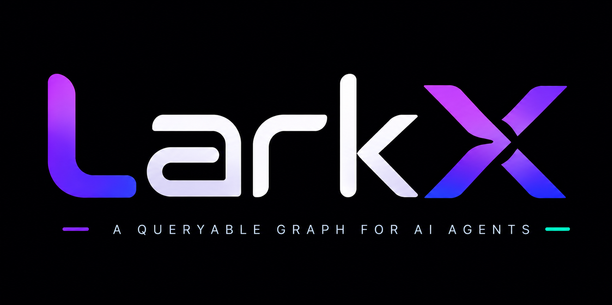

<div align="center">
  <a href="https://larkx.utoolslib.com/">
    
  </a>
  <p><strong>Give your AI agent a map of your codebase, not a flood of raw files.</strong></p>

  [](LICENSE)
  [](https://nodejs.org)
  [](https://modelcontextprotocol.io)

  <p>
    <a href="https://larkx.utoolslib.com/docs">Documentation</a> ·
    <a href="https://larkx.utoolslib.com/">Quick Start</a> ·
    <a href="https://larkx.utoolslib.com/docs/faq/">FAQ</a>
  </p>
</div>

## What is larkx?

When you ask Claude Code or Cursor to help with your code, the AI typically reads dozens of source files to figure out what's in your project. On a 200-file codebase that can cost **120,000+ tokens** before it writes a single line.

**larkx fixes this.** It pre-indexes your entire codebase, every file, function, class, import, and call relationship, into a compact graph. Your AI agent reads the graph instead of the files. Same understanding, a fraction of the cost.

> Works with Claude Code, Cursor, GitHub Copilot, Gemini CLI, OpenAI Codex, Continue, Zed, Windsurf, and any MCP-compatible agent.

## Token savings at a glance

| Project size | AI reads files directly | AI uses lark | You save |
|---|---|---|---|
| 50 files | ~30,000 tokens | ~4,000 tokens | **87%** |
| 200 files | ~120,000 tokens | ~16,000 tokens | **87%** |
| 500 files | ~300,000 tokens | ~40,000 tokens | **87%** |

*Based on ~600 tokens/file average. Run `larkx stats` to see exact numbers for your project.*

## Install

```bash
npm install -g larkx
```

## Get started in 60 seconds

```bash
cd your-project

larkx init      # one-time wizard: sets up MCP, agent files, and hooks
larkx index     # parse all files and build the index
larkx stats     # see token estimates per level for your project
```

After `larkx index`, a `.larkx/context.md` file is written to your project root. Every AI agent can read it with no extra setup needed.

## How your AI agent uses lark

larkx has three integration modes. You don't need all three, just pick what fits your agent.

### Mode 1: MCP server (Claude Code, Cursor, Continue, Zed, Windsurf)

larkx runs as a real [Model Context Protocol](https://modelcontextprotocol.io) server, giving your agent 6 targeted query tools instead of raw file access:

| Tool | What it answers | Cost |
|------|----------------|------|
| `get_project_index` | "What files and functions exist?" | ~8-250 tok/file |
| `search_symbol` | "Where is `validateUser` defined?" | ~30 tokens |
| `get_file_summary` | "What does `auth/login.ts` do?" | ~100 tokens |
| `get_impact` | "What breaks if I change this file?" | ~100 tokens |
| `get_call_chain` | "What calls `processPayment`?" | ~100 tokens |
| `get_dead_code` | "What code is never used?" | ~200 tokens |

```bash
# One-time global setup (terminal Claude Code)
claude mcp add larkx -- larkx mcp

# Per-project setup (VS Code), larkx init does this automatically
# Creates .mcp.json in your project root
```

### Mode 2: Context file (any agent that reads files)

Every `larkx index` run writes `.larkx/context.md`, a plain-text snapshot of your whole codebase at ~80 tokens/file. Agents that don't support MCP like Copilot, Codex, and Gemini just read this file directly.

`larkx init` creates `CLAUDE.md`, `.cursorrules`, `AGENTS.md`, and `GEMINI.md` that tell each agent to read this file before touching source code.

### Mode 3: CLI output (scripts and pipelines)

```bash
larkx context                        # full index to stdout
larkx context --level 1              # file paths only (~8 tok/file)
larkx context --level 4              # include AI summaries
larkx context --folder src/payments  # scope to a subtree
```

## Supported agents

| Agent | MCP | Context file |
|-------|:---:|:------------:|
| Claude Code | ✓ | ✓ |
| Cursor | ✓ | ✓ |
| Continue | ✓ | ✓ |
| Zed / Windsurf | ✓ | ✓ |
| GitHub Copilot | - | ✓ |
| OpenAI Codex | - | ✓ |
| Gemini CLI | - | ✓ |

## Supported languages

TypeScript · JavaScript · Python · Go · Rust · Java · C · C++ · C# · Ruby · PHP · Swift · Kotlin · Scala · Shell

Parsed with [tree-sitter](https://tree-sitter.github.io/tree-sitter/), fast and accurate with no language servers needed.

## CLI reference

| Command | What it does |
|---------|-------------|
| `larkx init` | Setup wizard for MCP, AI summaries, and agent instruction files |
| `larkx index` | Build or update the index and write `.larkx/context.md` |
| `larkx index --force` | Re-parse everything, ignoring the hash cache |
| `larkx index --ai` | Add one-sentence AI summaries per file |
| `larkx index --watch` | Keep the index live as you edit |
| `larkx stats` | Token estimates per level for your project |
| `larkx context` | Print the index to stdout |
| `larkx context --level <1-4>` | 1=paths, 2=symbols, 3=signatures, 4=summaries |
| `larkx context --folder <path>` | Scope to a subdirectory |
| `larkx search <name>` | Find a function or class by name |
| `larkx impact <file>` | List every file that imports a given file |
| `larkx deadcode` | Find files and functions nothing else references |
| `larkx serve` | Open the visual graph in your browser |
| `larkx mcp` | Start the MCP server |
| `larkx mcp --check` | Health-check (exit 0 = OK, exit 1 = not responding) |

## AI summaries (optional)

Run `larkx index --ai` to add a one-sentence description to every file. During `larkx init` you choose how to generate them:

- **Local Claude** uses your existing Claude Pro/Team subscription with no API key needed
- **Anthropic API key** billed per token at claude-haiku-4-5 rates

Summaries are cached so larkx only re-summarizes files that changed.

## Common questions

**Do I need an API key?**
No. Indexing, MCP server, context file, and all CLI commands work with zero API keys. AI summaries are the only optional feature that can use one.

**Does it work without MCP?**
Yes. Any agent reads `.larkx/context.md` as a regular file. larkx works with Copilot and Codex this way.

**Do MCP tool calls cost tokens?**
Yes, but targeted calls are tiny. `search_symbol` returns ~30 tokens. Reading the source file to find the same function costs 600+.

**What is `.larkx/context.md`?**
A pre-generated plain-text map of your codebase, written on every `larkx index` run. Think of it as a table of contents for your AI agent.

[More FAQs](https://larkx.utoolslib.com/docs/faq/)

## How it works

```
Your code
   |
   v
Walker > Parser (tree-sitter) > Graph builder > Incremental indexer (SHA-256)
                                                         |
                              +--------------------------+
                              v                          v
                        .larkx/context.md         MCP server
                     (read by any agent)     (6 tools for MCP clients)
```

1. **Walker** finds all code files and respects `.gitignore`
2. **Parser** extracts functions, classes, imports, exports, and call edges using tree-sitter with a regex fallback
3. **Graph** builds nodes (file, function, class) and edges (contains, imports, calls)
4. **Incremental index** uses SHA-256 per file so unchanged files reuse the cache
5. **context.md** is a level-2 snapshot written to `.larkx/context.md` on every run
6. **MCP server** exposes the same data as 6 query tools via stdio

## Documentation

[Full documentation](https://larkx.utoolslib.com/docs) covers setup guides, MCP integration, token optimization, framework support, configuration reference, visual graph, and FAQ.

## Ship faster with less token waste

larkx was built for developers who care about staying in flow. Less context noise, more signal. Your AI agent spends its budget understanding your code, not rediscovering it.

If larkx saves you time, share it with a teammate. That's the best thing you can do. ⭐
